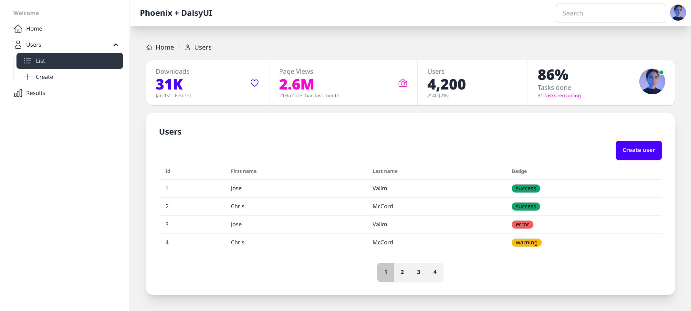

# 🌻 DaisyUI Components

[](https://github.com/phcurado/daisy_ui_components/actions/workflows/ci.yml)
[](https://coveralls.io/github/phcurado/daisy_ui_components?branch=main)
[](https://hex.pm/packages/daisy_ui_components)
[](https://hexdocs.pm/daisy_ui_components)
[](https://hex.pm/packages/daisy_ui_components)

📚 [Storybook](https://daisy-ui-components-site.fly.dev/storybook/welcome)

---

<a href='https://ko-fi.com/R5R11AIF9P' target='_blank'></a>

This project brings [DaisyUI](https://daisyui.com/) components into your [Phoenix](https://www.phoenixframework.org) project.



## 📦 Installation

<!-- MDOC -->

Add this package into your `mix.exs` file.

```elixir
def deps do
  [
    {:daisy_ui_components, "~> 0.8"}
  ]
end
```

Reference this project path into your `main.css` file:

```css
@source "../../lib/my_project_web";
@source "../../deps/daisy_ui_components";
```

Add error translation function to your app's config.exs file. This function is used to translate ecto changeset errors:

```elixir
config :daisy_ui_components, translate_function: &MyAppWeb.CoreComponents.translate_error/1
```

Reference the main `DaisyUIComponents` module inside your `html_helpers` to add all the components implemented in this library.

```elixir
defp html_helpers do
  quote do
    # Translation
    use Gettext, backend: MyAppWeb.Gettext

    # HTML escaping functionality
    import Phoenix.HTML

    # Import DaisyUI components into your project
    use DaisyUIComponents

    # Comment your own CoreComponents to not conflict with the defaults of this library.
    # import YourProjectWeb.CoreComponents
    # Importing CoreComponents from your project is no longer necessary since
    # `DaisyUIComponents` offers a drop in replacement
    # If you still want to use your own core components, remember to delete the default conflicting components generated from phoenix in this file
    # ...
  end
end
```

And that's it! This library is ready for usage 🚀

> [!NOTE]  
> New Phoenix applications already comes with DaisyUI installed, in case you use an older phoenix version or want to install it manually, follow the steps on [Installing DaisyUI Assets](##installing_daisyui-assets)

## ⭐ Core Components

This library aims to integrate seamlessly with Phoenix generators. For this reason you don't need the components inside the `CoreComponents` file after adding `use DaisyUIComponents` into your web file.
All the components should be compatible, styled with DaisyUI.

If you encounter any compatibility issues, feel free to open an `issue` or submit a `pull request`, and I'll take a look.

## 📦 Installing DaisyUI with NPM

On new Phoenix installations, the daisyUI assets already comes by default but you can still install it through `npm` if this is a requirement for your project. Adding `npm` into in your pproject requires some changes on the asset pipeline, so follow the steps below:

Add through `npm` the daisy UI package inside your phoenix application:

```bash
cd assets
npm i -D daisyui@5
```

For Tailwind v4, add in your `main.css` file the daisyui plugin:

```diff
-@plugin "../vendor/daisyui" {
-  themes: all;
-}
+@plugin "daisyui"
```

Configure in your project the asset pipeline to use the npm commands. In your `mix.exs` file, add the npm command in your assets setup:

```diff
"assets.setup": [
  "tailwind.install --if-missing",
- "esbuild.install --if-missing"
+ "esbuild.install --if-missing",
+ "cmd npm install --prefix assets"
]
```

and if you are deploying the application with `Docker`, run the npm scripts there too:

```diff
# install build dependencies
-RUN apt-get update -y && apt-get install -y build-essential git \
+RUN apt-get update -y && apt-get install -y build-essential git npm \
    && apt-get clean && rm -f /var/lib/apt/lists/*_*

# ...
RUN mix deps.compile

# build assets
+COPY assets/package.json assets/package-lock.json ./assets/
+RUN npm --prefix ./assets ci --progress=false --no-audit --loglevel=error
```

## Tailwind v3.0 Setup

It's recommended to use the tailwind v4, since this is also an requirement for the DaisyUI v5. If your application is still using an previous tailwind version, check [this](https://github.com/phoenixframework/tailwind?tab=readme-ov-file#updating-from-tailwind-v3-to-v4) upgrade guide from the phoenix tailwind installer.

If you still wish to use a previous tailwind version, follow the steps below.

On the `tailwind.config.js` file include the DaisyUI Components under the content list and reference under plugins

```javascript
module.exports = {
  content: [
    //...
    "../deps/daisy_ui_components/**/*.*ex", // <- reference DaisyUIComponents as content path
  ],
  //...
  plugins: [
    //...
    // comment the tailwind form to not conflict with DaisyUI
    // require("@tailwindcss/forms"),
    require("daisyui"), // <- add daisyUI plugin
    //...
  ],
};
```

## 🤖 Liveview 1.0

This project is fully compatible with the Liveview 1.0 🔥. If you are using a previous Liveview version, check the [migration guide](https://github.com/phoenixframework/phoenix_live_view/blob/v1.0/CHANGELOG.md).

## ⚡️ Components

List of available components.

### Actions

| Component                                                            | Status | Storybook |
| -------------------------------------------------------------------- | ------ | --------- |
| [Button](https://daisyui.com/components/button)                      | ✅     | ✅        |
| [Dropdown](https://daisyui.com/components/dropdown)                  | ✅     | ✅        |
| [Modal](https://daisyui.com/components/modal)                        | ✅     | ✅        |
| [Swap](https://daisyui.com/components/swap)                          | ✅     | ✅        |
| [Theme Controller](https://daisyui.com/components/theme-controller/) | ❌     | ❌        |

### Data Display

| Component                                             | Status | Storybook |
| ----------------------------------------------------- | ------ | --------- |
| [Accordion](https://daisyui.com/components/accordion) | ❌     | ❌        |
| [Avatar](https://daisyui.com/components/avatar)       | ✅     | ✅        |
| [Badge](https://daisyui.com/components/badge)         | ✅     | ✅        |
| [Card](https://daisyui.com/components/card)           | ✅     | ✅        |
| [Carousel](https://daisyui.com/components/carousel)   | ❌     | ❌        |
| [Chat bubble](https://daisyui.com/components/chat)    | ❌     | ❌        |
| [Collapse](https://daisyui.com/components/collapse)   | ❌     | ❌        |
| [Countdown](https://daisyui.com/components/countdown) | ❌     | ❌        |
| [Diff](https://daisyui.com/components/diff/)          | ❌     | ❌        |
| [Kbd](https://daisyui.com/components/kbd)             | ❌     | ❌        |
| [Stat](https://daisyui.com/components/stat)           | ✅     | ✅        |
| [Table](https://daisyui.com/components/table)         | ✅     | ✅        |
| [Timeline](https://daisyui.com/components/timeline/)  | ❌     | ❌        |

### Navigation

| Component                                                 | Status | Storybook |
| --------------------------------------------------------- | ------ | --------- |
| [Breadcrumbs](https://daisyui.com/components/breadcrumbs) | ✅     | ✅        |
| [Dock](https://daisyui.com/components/dock/)              | ❌     | ❌        |
| [Link](https://daisyui.com/components/link)               | ❌     | ❌        |
| [Menu](https://daisyui.com/components/menu)               | ✅     | ✅        |
| [Navbar](https://daisyui.com/components/navbar)           | ✅     | ✅        |
| [Pagination](https://daisyui.com/components/pagination)   | ✅     | ✅        |
| [Steps](https://daisyui.com/components/steps)             | ❌     | ❌        |
| [Tabs](https://daisyui.com/components/tab)                | ❌     | ❌        |

### Feedback

| Component                                                         | Status | Storybook |
| ----------------------------------------------------------------- | ------ | --------- |
| [Alert](https://daisyui.com/components/alert)                     | ✅     | ✅        |
| [Loading](https://daisyui.com/components/loading/)                | ✅     | ✅        |
| [Progress](https://daisyui.com/components/progress)               | ✅     | ✅        |
| [Radial progress](https://daisyui.com/components/radial-progress) | ❌     | ❌        |
| [Skeleton](https://daisyui.com/components/skeleton/)              | ❌     | ❌        |
| [Toast](https://daisyui.com/components/toast)                     | ❌     | ❌        |
| [Tooltip](https://daisyui.com/components/tooltip)                 | ✅     | ✅        |

### Data Input

| Component                                               | Status | Storybook |
| ------------------------------------------------------- | ------ | --------- |
| [Checkbox](https://daisyui.com/components/checkbox)     | ✅     | ✅        |
| [Fieldset](https://daisyui.com/components/fieldset)     | ✅     | ✅        |
| [File input](https://daisyui.com/components/file-input) | ❌     | ❌        |
| [Label](https://daisyui.com/components/label)           | ✅     | ✅        |
| [Radio](https://daisyui.com/components/radio)           | ✅     | ✅        |
| [Range](https://daisyui.com/components/range)           | ✅     | ✅        |
| [Rating](https://daisyui.com/components/rating)         | ❌     | ❌        |
| [Select](https://daisyui.com/components/select)         | ✅     | ✅        |
| [Text Input](https://daisyui.com/components/input)      | ✅     | ✅        |
| [Textarea](https://daisyui.com/components/textarea)     | ✅     | ✅        |
| [Toggle](https://daisyui.com/components/toggle)         | ✅     | ✅        |
| [Validator](https://daisyui.com/components/validator)   | ✅     | ✅        |

### Layout

| Component                                             | Status | Storybook |
| ----------------------------------------------------- | ------ | --------- |
| [Artboard](https://daisyui.com/components/artboard)   | ❌     | ❌        |
| [Divider](https://daisyui.com/components/divider)     | ❌     | ❌        |
| [Drawer](https://daisyui.com/components/drawer)       | ✅     | ✅        |
| [Footer](https://daisyui.com/components/footer)       | ✅     | ✅        |
| [Hero](https://daisyui.com/components/hero)           | ✅     | ✅        |
| [Indicator](https://daisyui.com/components/indicator) | ✅     | ✅        |
| [Join](https://daisyui.com/components/join)           | ✅     | ✅        |
| [Mask](https://daisyui.com/components/mask)           | ❌     | ❌        |
| [Stack](https://daisyui.com/components/stack)         | ❌     | ❌        |

### Mockup

| Component                                                 | Status | Storybook |
| --------------------------------------------------------- | ------ | --------- |
| [Browser](https://daisyui.com/components/mockup-browser/) | ❌     | ❌        |
| [Code](https://daisyui.com/components/mockup-code)        | ❌     | ❌        |
| [Phone](https://daisyui.com/components/mockup-phone)      | ❌     | ❌        |
| [Window](https://daisyui.com/components/mockup-window)    | ❌     | ❌        |

### Phoenix Core Components

| Component   | Status | Storybook |
| ----------- | ------ | --------- |
| Flash       | ✅     | ✅        |
| Header      | ✅     | ✅        |
| List        | ✅     | ✅        |
| Simple Form | ✅     | ✅        |
| Input       | ✅     | ✅        |
| Table       | ✅     | ✅        |

## 🗺️ Roadmap

- Update components for the new [DaisyUI 5](https://daisyui.com/docs/upgrade/)
- Implement all components from DaisyUI
- Document all components in Storybook
- Create `mix` script to enable users to import the components of this library into their projects, sharing the same project namespace.
