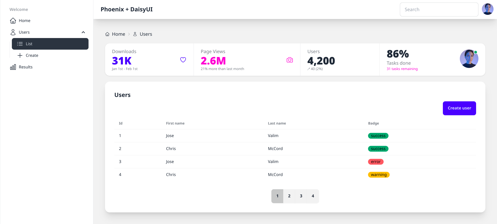

# 🌻 DaisyUI Components

[](https://github.com/phcurado/daisy_ui_components/actions/workflows/ci.yml)
[](https://coveralls.io/github/phcurado/daisy_ui_components?branch=main)
[](https://hex.pm/packages/daisy_ui_components)
[](https://hexdocs.pm/daisy_ui_components)
[](https://hex.pm/packages/daisy_ui_components)

📚 [Storybook](https://daisy-ui-components-site.fly.dev/storybook/welcome)

---

<a href='https://ko-fi.com/R5R11AIF9P' target='_blank'></a>

This project brings [DaisyUI](https://daisyui.com/) components into your [Phoenix](https://www.phoenixframework.org) project.



## 📦 Installation

<!-- MDOC -->

### Installing it with mix archive installer

```bash
mix archive.install hex daisy_ui_installer
```

In the Phoenix project folder

```bash
mix daisy
```

Alternative, you can just install a single component

```bash
mix daisy badge input
```

**_NOTE:_** This will install the components and it's dependencies.

### Installing as a dependency

Reference this repository on your `mix.exs` file to start using.

```elixir
def deps do
  [
    {:daisy_ui_components, "~> 0.9"}
  ]
end
```

### DaisyUI Assets

Phoenix 1.8+ uses `tailwind` and `daisyui` configured out of the box. If your project is using an older version of Phoenix, you can install the `daisyui` package manually.
Follow the official [DaisyUI installation guide](https://daisyui.com/docs/install/) to install the package.

### Configuration

In order to use the translations that comes with phoenix, it's recommended to set the `translate_function` in your `config.exs` file.

```elixir
config :daisy_ui_components, translate_function: &MyAppWeb.CoreComponents.translate_error/1
```

And to finalize, add under the `app.css` file the following line to import this library tailwind styles:

```css
@source "../../deps/daisy_ui_components";
```

Some components require JavaScript to work properly. Add the following import to your `assets/js/app.js` file:

```js
import "phoenix-colocated/daisy_ui_components";
```

## 🧩 Usage

To use the components in your project, you need to import the `DaisyUIComponents` module in your web file, typically `lib/my_app_web.ex`.

```diff
defp html_helpers do
  quote do
    # Translation
    use Gettext, backend: MyAppWeb.Gettext

    # HTML escaping functionality
    import Phoenix.HTML

+   # Import DaisyUI components into your project
+   use DaisyUIComponents, core_components: false
    import YourProjectWeb.CoreComponents
  end
end
```

This will make all the components available in your templates with the exception of the phoenix `core_components.ex` and `layouts.ex` components.
If you want to use all DaisyUIComponents, set `core_components: true` and remove the import for the phoenix CoreComponents.

```diff
defp html_helpers do
  quote do
    # Translation
    use Gettext, backend: MyAppWeb.Gettext

    # HTML escaping functionality
    import Phoenix.HTML

+   # Import DaisyUI components into your project
+   use DaisyUIComponents, core_components: true
-   import YourProjectWeb.CoreComponents
  end
end
```

You may also find component conflicts on the `layout.ex` file, you will need to comment the `flash_group/1` component there too.

## ⭐ Core Components

This library aims to integrate seamlessly with Phoenix generators. For this reason you don't need the components inside the `CoreComponents` after adding `use DaisyUIComponents` into your web file.
All the components should be compatible, styled with DaisyUI.

If you encounter any compatibility issues, feel free to open an `issue` or submit a `pull request`, and I'll take a look.

## 🤖 Liveview 1.0

This project is fully compatible with the Liveview 1.0 🔥. If you are using a previous Liveview version, check the [migration guide](https://github.com/phoenixframework/phoenix_live_view/blob/v1.0/CHANGELOG.md).

## ⚡️ Components

List of available components.

### Actions

| Component                                                            | Status | Storybook |
| -------------------------------------------------------------------- | ------ | --------- |
| [Button](https://daisyui.com/components/button)                      | ✅     | ✅        |
| [Dropdown](https://daisyui.com/components/dropdown)                  | ✅     | ✅        |
| [Modal](https://daisyui.com/components/modal)                        | ✅     | ✅        |
| [Swap](https://daisyui.com/components/swap)                          | ✅     | ✅        |
| [Theme Controller](https://daisyui.com/components/theme-controller/) | ❌     | ❌        |

### Data Display

| Component                                             | Status | Storybook |
| ----------------------------------------------------- | ------ | --------- |
| [Accordion](https://daisyui.com/components/accordion) | ✅     | ✅        |
| [Avatar](https://daisyui.com/components/avatar)       | ✅     | ✅        |
| [Badge](https://daisyui.com/components/badge)         | ✅     | ✅        |
| [Card](https://daisyui.com/components/card)           | ✅     | ✅        |
| [Carousel](https://daisyui.com/components/carousel)   | ❌     | ❌        |
| [Chat bubble](https://daisyui.com/components/chat)    | ❌     | ❌        |
| [Collapse](https://daisyui.com/components/collapse)   | ✅     | ❌        |
| [Countdown](https://daisyui.com/components/countdown) | ❌     | ❌        |
| [Diff](https://daisyui.com/components/diff/)          | ❌     | ❌        |
| [Kbd](https://daisyui.com/components/kbd)             | ❌     | ❌        |
| [Stat](https://daisyui.com/components/stat)           | ✅     | ✅        |
| [Table](https://daisyui.com/components/table)         | ✅     | ✅        |
| [Timeline](https://daisyui.com/components/timeline/)  | ❌     | ❌        |

### Navigation

| Component                                                 | Status | Storybook |
| --------------------------------------------------------- | ------ | --------- |
| [Breadcrumbs](https://daisyui.com/components/breadcrumbs) | ✅     | ✅        |
| [Dock](https://daisyui.com/components/dock/)              | ❌     | ❌        |
| [Link](https://daisyui.com/components/link)               | ❌     | ❌        |
| [Menu](https://daisyui.com/components/menu)               | ✅     | ✅        |
| [Navbar](https://daisyui.com/components/navbar)           | ✅     | ✅        |
| [Pagination](https://daisyui.com/components/pagination)   | ✅     | ✅        |
| [Steps](https://daisyui.com/components/steps)             | ✅     | ❌        |
| [Tabs](https://daisyui.com/components/tab)                | ✅     | ❌        |

### Feedback

| Component                                                         | Status | Storybook |
| ----------------------------------------------------------------- | ------ | --------- |
| [Alert](https://daisyui.com/components/alert)                     | ✅     | ✅        |
| [Loading](https://daisyui.com/components/loading/)                | ✅     | ✅        |
| [Progress](https://daisyui.com/components/progress)               | ✅     | ✅        |
| [Radial progress](https://daisyui.com/components/radial-progress) | ❌     | ❌        |
| [Skeleton](https://daisyui.com/components/skeleton/)              | ❌     | ❌        |
| [Toast](https://daisyui.com/components/toast)                     | ❌     | ❌        |
| [Tooltip](https://daisyui.com/components/tooltip)                 | ✅     | ✅        |

### Data Input

| Component                                               | Status | Storybook |
| ------------------------------------------------------- | ------ | --------- |
| [Checkbox](https://daisyui.com/components/checkbox)     | ✅     | ✅        |
| [Fieldset](https://daisyui.com/components/fieldset)     | ✅     | ✅        |
| [File input](https://daisyui.com/components/file-input) | ❌     | ❌        |
| [Label](https://daisyui.com/components/label)           | ✅     | ✅        |
| [Radio](https://daisyui.com/components/radio)           | ✅     | ✅        |
| [Range](https://daisyui.com/components/range)           | ✅     | ✅        |
| [Rating](https://daisyui.com/components/rating)         | ❌     | ❌        |
| [Select](https://daisyui.com/components/select)         | ✅     | ✅        |
| [Text Input](https://daisyui.com/components/input)      | ✅     | ✅        |
| [Textarea](https://daisyui.com/components/textarea)     | ✅     | ✅        |
| [Toggle](https://daisyui.com/components/toggle)         | ✅     | ✅        |
| [Validator](https://daisyui.com/components/validator)   | ✅     | ✅        |

### Layout

| Component                                                                                  | Status | Storybook |
| ------------------------------------------------------------------------------------------ | ------ | --------- |
| [Artboard](https://daisyui.com/components/artboard)                                        | ❌     | ❌        |
| [Divider](https://daisyui.com/components/divider)                                          | ❌     | ❌        |
| [Drawer](https://daisyui.com/components/drawer)                                            | ✅     | ✅        |
| [Sidebar](https://daisy-ui-components-site.fly.dev/storybook/components/sidebar)(Internal) | ✅     | ✅        |
| [Footer](https://daisyui.com/components/footer)                                            | ✅     | ✅        |
| [Hero](https://daisyui.com/components/hero)                                                | ✅     | ✅        |
| [Indicator](https://daisyui.com/components/indicator)                                      | ✅     | ✅        |
| [Join](https://daisyui.com/components/join)                                                | ✅     | ✅        |
| [Mask](https://daisyui.com/components/mask)                                                | ❌     | ❌        |
| [Stack](https://daisyui.com/components/stack)                                              | ❌     | ❌        |

### Mockup

| Component                                                 | Status | Storybook |
| --------------------------------------------------------- | ------ | --------- |
| [Browser](https://daisyui.com/components/mockup-browser/) | ❌     | ❌        |
| [Code](https://daisyui.com/components/mockup-code)        | ❌     | ❌        |
| [Phone](https://daisyui.com/components/mockup-phone)      | ❌     | ❌        |
| [Window](https://daisyui.com/components/mockup-window)    | ❌     | ❌        |

### Phoenix Core Components

| Component   | Status | Storybook |
| ----------- | ------ | --------- |
| Flash       | ✅     | ✅        |
| Header      | ✅     | ✅        |
| List        | ✅     | ✅        |
| Simple Form | ✅     | ✅        |
| Input       | ✅     | ✅        |
| Table       | ✅     | ✅        |

## 🤩 Contributors

<a href="https://github.com/phcurado/daisy_ui_components/graphs/contributors">
  
</a>
